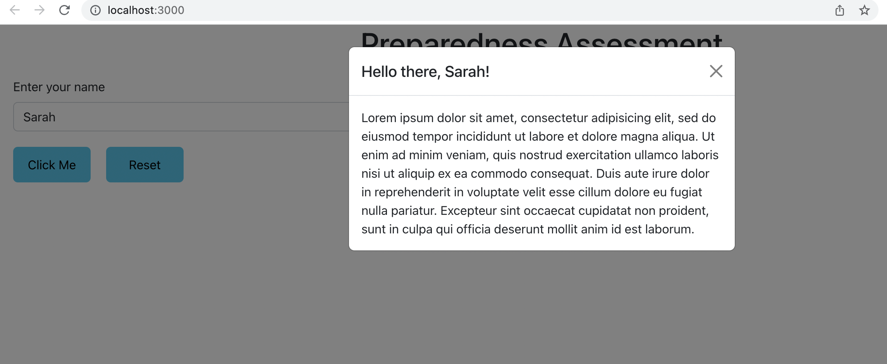

# Preparedness Assessment

### Frontend Assessment

- [Reactstrap Modal](https://reactstrap.github.io/?path=/docs/components-modal--modal)
- Create an input field that invites the user to enter their name


- On submit, the user will see a model that greets them



### Backend Assessment

- Go to [dbdiagram](https://dbdiagram.io/) and create a free personal account
- Start a new diagram
- Enter the following into the left side bar

```sql
Table person {
  id integer
  created_at timestamp
  updated_at timestamp
}

Table car {
  id integer
  created_at timestamp
  updated_at timestamp
}

Table house {
  id integer
  created_at timestamp
  updated_at timestamp
}
```

- Add foreign keys to create relationships between tables
- Use the following example from the syllabus section for creating relationships between a model called owner and a model called credit_card

```sql
Table owner {
  id integer
  created_at timestamp
  updated_at timestamp
}

Table credit_cards {
  id integer
  owner_id integer [ref: > owner.id]
  created_at timestamp
  updated_at timestamp
}
```

- Are there other ways to define the relationship between the person, house, and car models? Create additional diagrams in the application to show other options.
